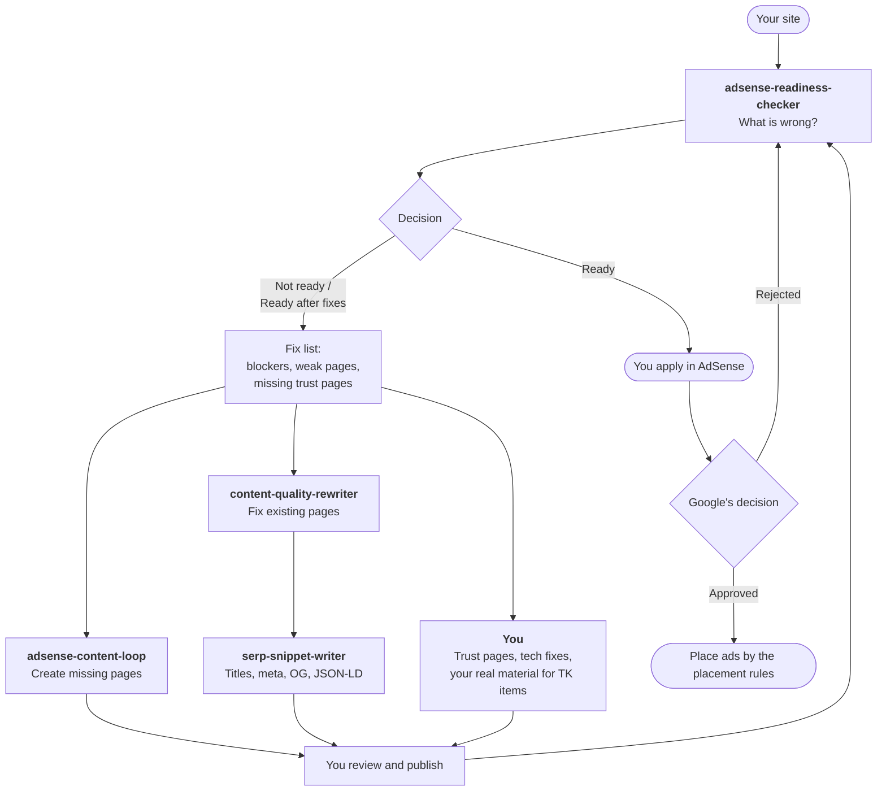
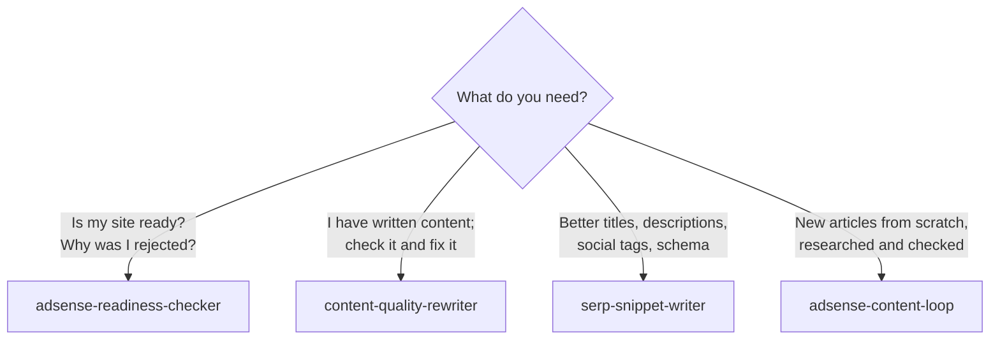
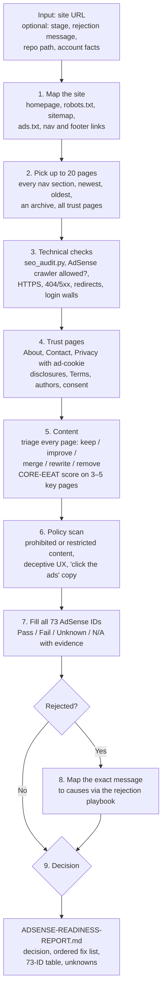
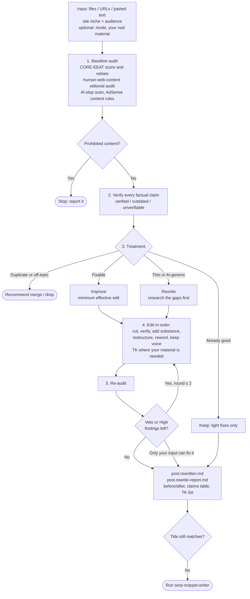
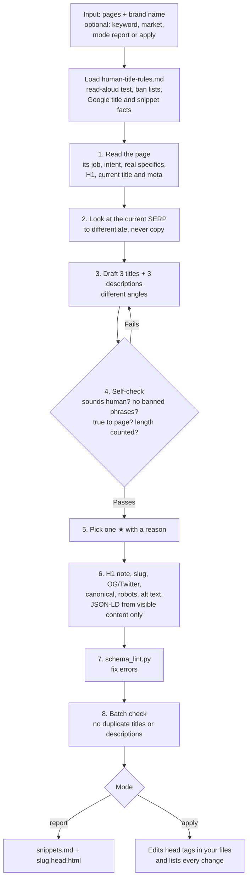
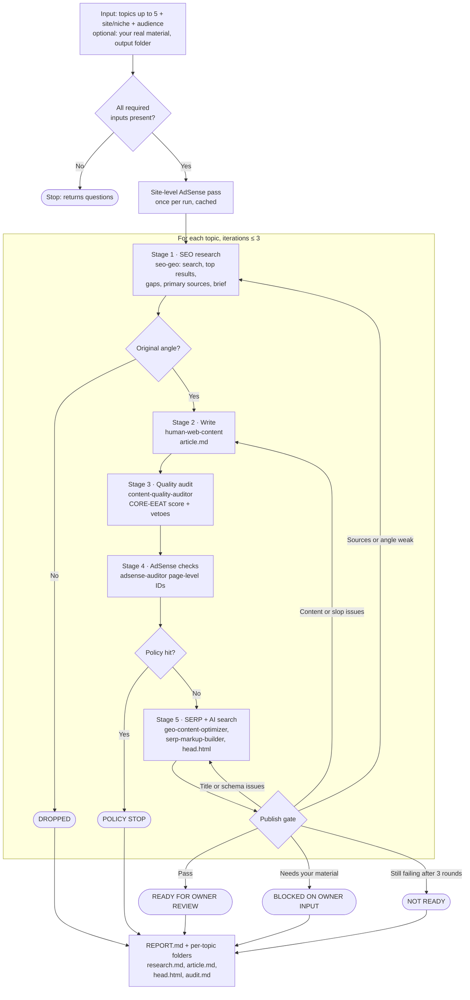
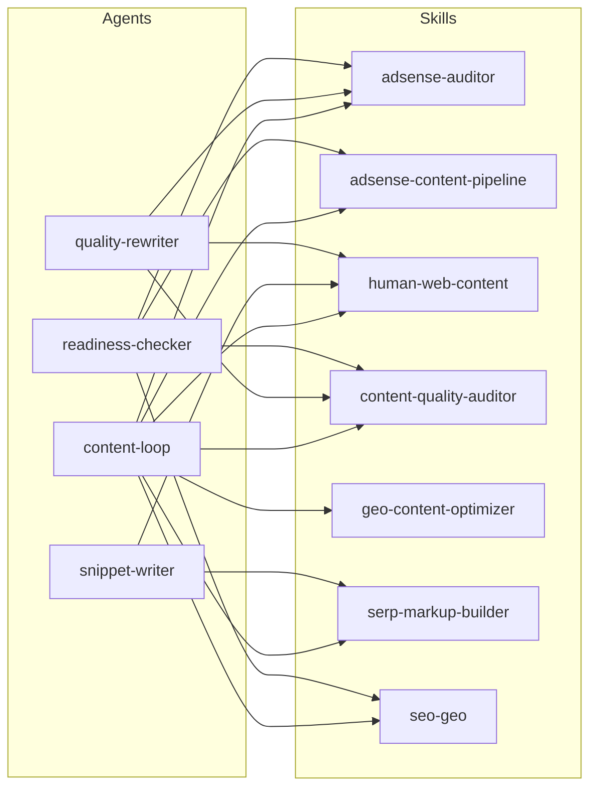
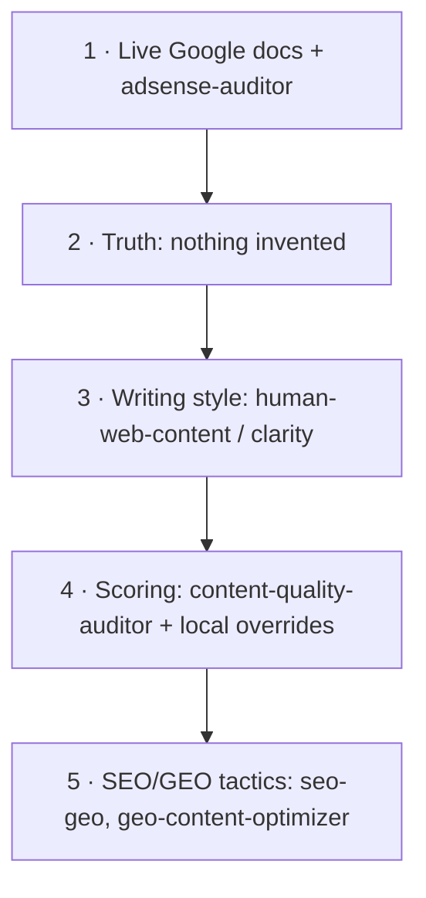

# Agent Flows

How the four agents work, which skills each one uses, and how to run them. The diagrams are Mermaid, so they render as flowcharts on GitHub and in VS Code's Markdown preview.

- [1. The big picture](#1-the-big-picture)
- [2. Which agent do I use?](#2-which-agent-do-i-use)
- [3. adsense-readiness-checker](#3-adsense-readiness-checker)
- [4. content-quality-rewriter](#4-content-quality-rewriter)
- [5. serp-snippet-writer](#5-serp-snippet-writer)
- [6. adsense-content-loop](#6-adsense-content-loop)
- [7. Skills each agent uses](#7-skills-each-agent-uses)
- [8. Rules every agent follows](#8-rules-every-agent-follows)
- [9. Install and run](#9-install-and-run)

---

## 1. The big picture

A typical AdSense push: check the site, fix the existing pages, add new pages, fix the snippets, then check again before applying.



The `adsense-content-pipeline` skill is the rulebook behind all of this. It holds the phases, the publish gate, the rules for which skill wins when they disagree, and the rejection playbook. The agents follow it.

---

## 2. Which agent do I use?



| Agent | Changes files? | Typical run |
|---|---|---|
| `adsense-readiness-checker` | No. Writes one report. | 1 site, up to 20 pages sampled |
| `content-quality-rewriter` | Writes `*.rewritten.md` next to the original; never overwrites | 1–5 pages |
| `serp-snippet-writer` | Writes a snippets report; edits head tags only in `apply` mode | 1–50 pages |
| `adsense-content-loop` | Writes a new folder per topic | 1–5 topics |

---

## 3. adsense-readiness-checker

**Purpose:** a read-only inspection of the whole site, ending with *Ready / Ready after fixes / Not ready*.



**How to run it**

> Use adsense-readiness-checker on https://example.in. Stage: rejected, message "Low value content". Traffic is organic plus Instagram. No existing AdSense account.

**What you get:** a decision line, Blocker and High counts, the top 5 fixes (each naming the agent or person that should do it), and a list of **Unknowns** that need your AdSense dashboard, server access, or a mobile check.

**Keep in mind:** it never edits the site. Anything it can't observe, such as rendered mobile layout or pop-ups, is marked Unknown rather than guessed.

---

## 4. content-quality-rewriter

**Purpose:** audit content that is already written, rewrite it to pass the rules, re-audit it, and show the before/after.



**How to run it**

> Use content-quality-rewriter on content/posts/gst-for-freelancers.md and content/posts/upi-limits.md. Site: Indian personal-finance blog, audience Indian freelancers. I'm a CA with 6 years of practice; use that where it fits.

**What you get:** a rewritten copy next to each original (the original is never overwritten), plus a report with the before/after verdict, what was cut or added and why, every claim with its source, and the `[TK]` questions only you can answer.

**Keep in mind:** it stops after 2 fix rounds instead of polishing endlessly. If a page is already good, it tells you so and leaves it alone.

---

## 5. serp-snippet-writer

**Purpose:** everything the page shows in Google and on social: titles, descriptions, H1 check, slug, OG/Twitter tags, alt text, and JSON-LD. The titles must sound like a person wrote them.



**What "human touch" means here:**

| AI-template title | Human title |
|---|---|
| How to File GST Returns: The Complete Guide (2026) | How to File GSTR-1 as a Freelancer, Step by Step |
| What Is TDS? Here's Everything You Need to Know | What TDS Is and When It's Deducted From Your Pay |

**How to run it**

> Use serp-snippet-writer on https://example.in/blog/ (all posts in the sitemap). Brand: Example Finance. Market: India, English. Report mode.

**Keep in mind:** a title can't promise more than the page delivers. If the content is the problem, it tells you to run `content-quality-rewriter` first.

---

## 6. adsense-content-loop

**Purpose:** create new pages from scratch. Each topic loops through research, writing, the quality audit, AdSense checks, and SERP markup until it passes the publish gate.



**How to run it**

> Use adsense-content-loop: 3 articles — "GSTR-1 for freelancers", "UPI transaction limits by bank", "Section 44ADA explained". Site example.in, Indian freelancers. Author: CA, 6 years' practice. Output: ./content/.

**What you get:**

```
content/
  REPORT.md
  gstr-1-freelancers/
    research.md   brief, sources, SERP notes
    article.md    the page
    head.html     title, meta, OG, JSON-LD
    audit.md      scores, AdSense checks, gate log, TK list
```

**Keep in mind:** it never publishes. Every page ends at *ready for your review*, and anything that needs your real experience becomes a `[TK]` question.

---

## 7. Skills each agent uses

"Pre" means the skill is loaded at startup; "✓" means the agent calls it at the step that needs it.

| Skill | readiness-checker | quality-rewriter | snippet-writer | content-loop |
|---|:-:|:-:|:-:|:-:|
| `adsense-auditor` | **pre** | ✓ | | ✓ |
| `adsense-content-pipeline` | ✓ | | | **pre** |
| `human-web-content` | ✓ | **pre** | ✓ | ✓ |
| `clarity` | | ✓ | | ✓ |
| `content-quality-auditor` | ✓ | ✓ | | ✓ |
| `geo-content-optimizer` | | | | ✓ |
| `serp-markup-builder` | | | **pre** | ✓ |
| `seo-geo` | ✓ | | | ✓ |
| `pagewell` | | | | ✓ (repos only) |



---

## 8. Rules every agent follows

When skills disagree, this order wins (from `adsense-content-pipeline`):



- **Nothing invented:** no fake stats, quotes, experiences, reviewers, ratings, or dates. Gaps become `[TK: question]` for you.
- **No approval promises:** AdSense approval is Google's decision.
- **No bulk pages:** at most 5 topics per run.
- **No mid-run questions:** agents can't ask you anything while running. If inputs are missing, they stop at once and return their questions.
- **No publishing:** agents never publish, apply to AdSense, or push to a live site.

---

## 9. Install and run

```bash
# from this repo's root
cp agents/*.md ~/.claude/agents/
cp -r skills/* ~/.claude/skills/
```

On Windows, the target is `C:\Users\<you>\.claude\agents\` and `...\.claude\skills\`. Restart Claude Code afterwards so it picks them up.

Then just ask in plain words; Claude hands the job to the agent whose description matches:

| Say | Runs |
|---|---|
| "Is example.in ready for AdSense?" | `adsense-readiness-checker` |
| "Check and rewrite these 3 posts" | `content-quality-rewriter` |
| "Rewrite the titles and meta for my blog, make them sound human" | `serp-snippet-writer` |
| "Write 3 AdSense-ready articles on …" | `adsense-content-loop` |

You can also name the agent directly: *"Use serp-snippet-writer on …"*.
